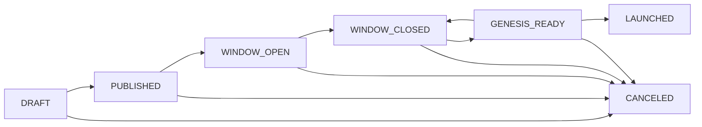

# chaincoord

> **Training project for an SDD (Spec Driven Development) exercise.** This codebase was built to explore
> the design space of decentralised genesis coordination. The heavy lifting was done by a supervised AI
> agent. It is research-grade — not for production use.

Self-hosted coordination server and CLI for **Cosmos SDK** chain genesis launches.

---

## What it does

Launching a Cosmos SDK chain requires assembling a genesis file from validator contributions, reaching
multi-party agreement on its content, and ensuring every participant starts from the same file at the
same time. Doing this informally — over chat or shared drives — is error-prone and unaccountable.

**chaincoord** makes the process explicit, auditable, and multi-party. It covers the full launch lifecycle:



Every state transition is driven by a **committee proposal** that requires M-of-N coordinator signatures
before it executes. A tamper-evident audit log records every action and can be verified offline.

---

## Key concepts

| Concept | Description |
|---|---|
| **Committee** | M-of-N group of coordinators governing a launch. Any member can raise a proposal; M must sign for it to execute; one VETO kills it. |
| **Proposal** | A signed, time-limited action (validator approval, lifecycle transition, genesis update, committee change). |
| **Join Request** | A validator's application carrying their `gentx`, operator address, and self-delegation amount. |
| **Audit Log** | Append-only JSONL file; each entry is Ed25519-signed by the server and verifiable offline with `coordd audit verify`. |

---

## Components

| Binary | Role |
|---|---|
| `coordd` | Coordination server — HTTP API + background block monitor |
| `smoke-signer` | Test utility for signing committee and validator actions in E2E / smoke tests |

---

## Quick start

```bash
# Build
git clone https://github.com/ny4rl4th0t3p/chaincoord.git
cd chaincoord
make build

# Generate keys
mkdir -p data
bin/coordd keygen > data/audit_key
bin/coordd keygen > data/jwt_key
chmod 600 data/audit_key data/jwt_key

# Configure (minimal)
cat > config.yaml <<EOF
listen_addr: ":8080"
db_path: "./data/coord.db"
audit_log_path: "./data/audit.jsonl"
genesis_path: "./data/genesis"
log_level: "debug"
audit_private_key_file: "./data/audit_key"
jwt_private_key_file: "./data/jwt_key"
EOF

# Migrate and run
bin/coordd migrate --config config.yaml
bin/coordd serve --config config.yaml

# Verify
curl http://localhost:8080/healthz
# → {"status":"ok"}
```

---

## Documentation

- [Concepts overview](docs/mkdocs/concepts/overview.md) — roles, proposals, and the audit log
- [Launch lifecycle](docs/mkdocs/concepts/lifecycle.md) — all seven states in detail
- [Roles](docs/mkdocs/concepts/roles.md) — lead coordinator, coordinator, validator
- [Proposals & M-of-N](docs/mkdocs/concepts/proposals.md) — all action types and signing rules
- [Setup & Configuration](docs/mkdocs/setup.md) — full config reference, TLS, CORS, production options
- [Quickstart](docs/mkdocs/getting-started/quickstart.md) — step-by-step local setup
- [Docker](docs/mkdocs/getting-started/docker.md) — containerised deployment
- [Smoke test](docs/mkdocs/getting-started/smoke-test.md) — end-to-end protocol against a live chain
- [API reference](docs/mkdocs/reference/api.md) — HTTP endpoints
- [Audit CLI](docs/mkdocs/reference/audit.md) — offline log verification

---

## Limitations

- Cosmos SDK chains only (secp256k1 keys, `gentx`-based genesis, CometBFT RPC)
- Does not run or connect to a chain node during the launch phase
- Does not store private keys — all signing happens client-side
- Does not assemble the final genesis file — that step is done locally by the coordinator using the chain's node binary (e.g. `gaiad genesis collect-gentxs`, `evmosd genesis collect-gentxs`, etc.)
- SQLite-backed by default; not designed for high availability
- Storage and RPC layers are interface-backed — adding PostgreSQL, MySQL, or a different chain RPC adapter requires only implementing the relevant interface and wiring it at startup
